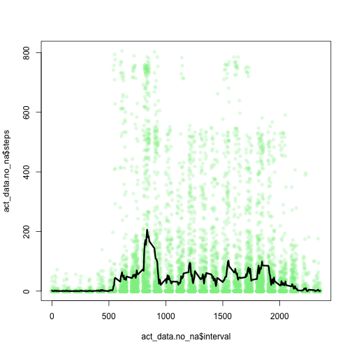
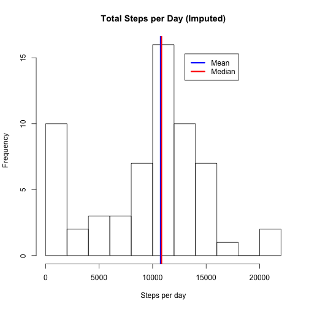

# Reproducible Research: Peer Assessment 1

Here we will analize data from an unspecified *personal activity monitoring device*. The device collects data a 5 minute intervals through out the day. The data consists of two months of data from an anonymous individual collected during the months of October and November, 2012 and include the number of steps taken in 5 minute intervals each day.

## Loading and preprocessing the data


```r
setwd("~/Desktop/data_science/05_reproduce/assign/RepData_PeerAssessment1/")
# extract and load activity.csv file from activity.zip
act_data <- read.csv(unz("activity.zip", "activity.csv"))
act_data.no_na <- act_data[!is.na(act_data$steps), ]  # remove NAs
percent_na <- round(sum(is.na(act_data$steps))/length(act_data$steps) * 100, 
    2)  # note percent missing
```


## What is mean total number of steps taken per day?


```r

steps_per_day = tapply(act_data.no_na$steps, act_data.no_na$date, sum)
steps_per_day[is.na(steps_per_day)] = 0

# create a data frame
mean_total_steps <- round(mean(steps_per_day))
```


The mean total number of steps per day, rounded to the nearest step, is 9354.

## What is the average daily activity pattern?

To do this we will again use the `tapply` function, but this time we will condition on  the `interval` factor. This will calculate the mean number of steps in each five minuite interval for each day. In the plot below, the dailty average is plotted as the solid black line while the individual data points are plotted as low transparency points so as to give us an idea of their density per interval.


```r
library(scales)  # for alpha() function
mean_steps_per_interval = tapply(act_data.no_na$steps, act_data.no_na$interval, 
    mean)
plot(act_data.no_na$interval, act_data.no_na$steps, col = alpha("light green", 
    0.25), pch = 16)
lines(names(mean_steps_per_interval), mean_steps_per_interval, lwd = 3, col = "black")
```

 


## Imputing missing values

Lets assume that missing values from each interval are missing **at random**, that is there is no underlying process that is biasing the process. We also note that only approximately 13.11% of our original sample is missing, meaning we likely still have a representative sample. Thus, it is reasonable to impute missing values in an inverval by taking a random sample from those observed in the same interval on other days. 


```r
set.seed(12345)  # set random seed for replocation
missing_set <- act_data[is.na(act_data$steps), ]  # NAs samples to impute
non_missing_set <- act_data[!is.na(act_data$steps), ]  # observed samples

# interate through the missing_set, noting the interval for each iteraction,
# and taking a random sample from the non_missing_set and imputing that
# value into the original data frame act_data
for (i in row.names(missing_set)) {
    # note interval
    missing_interval = act_data[i, "interval"]
    # create a sample set for the missing interval
    sample_set <- non_missing_set[non_missing_set$interval == missing_interval, 
        "steps"]
    # take sample
    samp <- sample(sample_set, size = 1, replace = TRUE)
    # impute value in data frame
    act_data[i, "steps"] = samp
}
```


At this point in might be prudent to replot our data again to check to see if the reuslts changed between our naive method, where we replaced all NA's with zero, and our new *random sample* imputation method we just performed.

```
# plot the activity levels again to see if there are any differences
mean_steps_per_interval <- tapply(act_data$steps, act_data$interval, mean)
plot(act_data$interval, act_data$steps, col = alpha("light green", 0.25),
     pch=16,xlab="Interval", ylab="Number of Steps", 
     main="Averaage number of steps per 5-min interval (imputed)")
lines(names(mean_steps_per_interval), mean_steps_per_interval, lwd=3, col="black")
```

Doesn't look to be that substantial a change.  We can guess that where the activity levels are low that this corresponds to when people are sleeping, so each 5-min interval is relative to 12am. Before we go to the next question it might be interesting to replace the interval with a timestamp.

## Are there differences in activity patterns between weekdays and weekends?


```r
act_data$dayOfWeek = weekdays(as.Date(act_data$date))
act_data$weekend = (act_data$dayOfWeek %in% c("Saturday", "Sunday"))
act_data_weekend = act_data[act_data$weekend == TRUE, ]
act_data_weekday = act_data[act_data$weekend == FALSE, ]

quartz()
mean_steps_per_interval = tapply(act_data_weekend$steps, act_data_weekend$interval, 
    mean)
plot(act_data_weekend$interval, act_data_weekend$steps, col = alpha("salmon", 
    0.25), pch = 16)
points(act_data_weekday$interval, act_data_weekday$steps, col = alpha("light blue", 
    0.25), pch = 16)
lines(names(mean_steps_per_interval), mean_steps_per_interval, lwd = 3, col = "red")
mean_steps_per_interval = tapply(act_data_weekday$steps, act_data_weekday$interval, 
    mean)
lines(names(mean_steps_per_interval), mean_steps_per_interval, lwd = 3, col = "blue")
```

 

```r

```

