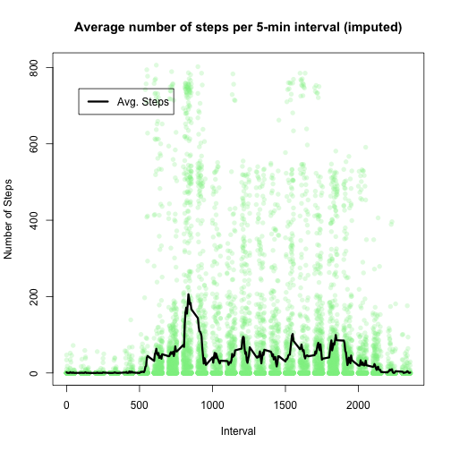

# Reproducible Research: Peer Assessment 1

Here we will analize data from an unspecified *personal activity monitoring device*. The device collects data a 5 minute intervals through out the day. The data consists of two months of data from an anonymous individual collected during the months of October and November, 2012 and include the number of steps taken in 5 minute intervals each day.

## Loading and preprocessing the data


```r
setwd("~/Desktop/data_science/05_reproduce/assign/RepData_PeerAssessment1/")
# extract and load activity.csv file from activity.zip
act_data <- read.csv(unz("activity.zip", "activity.csv"))
act_data <- act_data[!is.na(act_data$steps), ]  # remove NAs
```


## What is mean total number of steps taken per day?


```r
steps_per_day = tapply(act_data$steps, act_data$date, sum)
steps_per_day[is.na(steps_per_day)] = 0

# create a data frame
mean_total_steps <- round(mean(steps_per_day))
```


The mean total number of steps per day, rounded to the nearest step, is 9354.

## What is the average daily activity pattern?


```r
library(scales)
mean_steps_per_interval = tapply(act_data$steps, act_data$interval, mean)
sd_steps_per_interval = tapply(act_data$steps, act_data$interval, sd)
plot(act_data$interval, act_data$steps, col = alpha("light blue", 0.25), pch = 16)
lines(names(mean_steps_per_interval), mean_steps_per_interval, lwd = 3, col = "black")
lines(names(sd_steps_per_interval), mean_steps_per_interval + sd_steps_per_interval, 
    lwd = 1.5, col = "magenta")


library(lattice)
```

 

```r
# little function to plot points and add smoother
panel.smooth <- function(x, y) {
    panel.xyplot(x, y)  # show points 
    panel.loess(x, y)  # show Local Polynomial Regression line
}
xyplot(totalSteps ~ interval, panel = panel.smooth, data = df)
```

```
## Error: invalid 'envir' argument of type 'closure'
```


## Imputing missing values


## Are there differences in activity patterns between weekdays and weekends?
